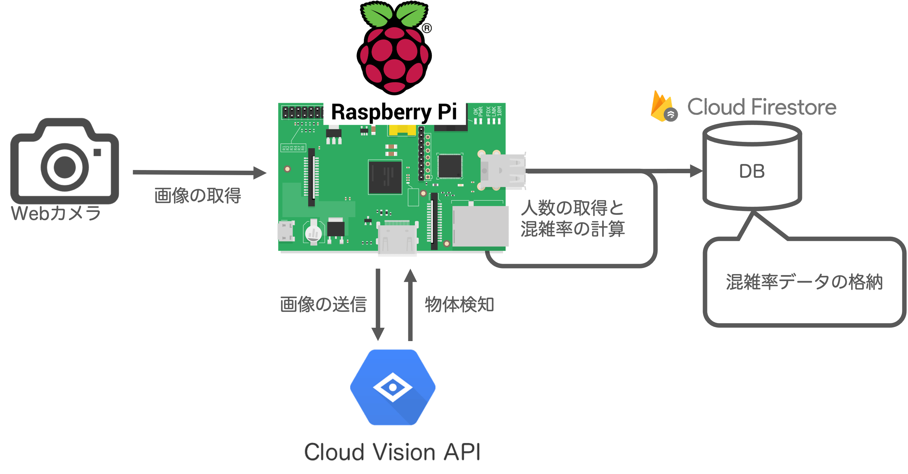

# Web カメラを用いた簡易的な「混雑率推定システム」

## 概要

RaspberryPi と Web カメラを用いた簡易的な「**混雑率推定のためのシステム**」です．開発プロセスは [Zenn でドキュメント化](https://zenn.dev/kenken82/articles/c93053a8fb21f3)してあります．詳しい情報はそちらを参照してください．ただし，こちらのリポジトリは定期的にアップデートされるのでドキュメントの内容と変わっていることもあります．

### できること

1. Web カメラで画像を撮影する
2. 画像を Google の Cloud Vision API に送る
3. Cloud Vision API で人の検出 (およびカウント) をおこなう
4. 返ってきた結果から混雑率を計算する
5. データベースに格納する

RaspberryPi でエッジコンピューティングの入門を行う目的で開発したものですがローカルでも動きます．

### システム構成



### 開発環境 (動作確認済み)

- **Local : macOS Monterey (12.1)**
  - Node.js (v12.21.0)
  - npm (7.5.2)
- **RaspberryPi 4 Model B (RAM 4GB)**
  - **OS : Ubuntu Desktop ( 20.04.3 64-bit )**
  - Node.js (v12.21.0)
  - npm (7.5.2)
- DB
  - Cloud Firestore

## リポジトリ情報

### ディレクトリ構成

基本的なディレクトリ構成以下のようになっています．どのファイルを編集するかは，この構成を元に説明していきます(必要なファイルだけ記述しています)．

※ ディレクトリ構成はマークダウンの関係で記述が崩れてしまい正確ではない部分があるのであくまで参考程度にしてください．

```js
congestion-estimation
     L package.json
     L README.md
     L img.jpg (Webカメラで撮影した画像)
     L src
         L index.js (これはルーティング用なので今回使わない)
	       L edge.js (ラズパイではこのファイルを実行するだけ)
	       L config.js (認証情報など(gitにはpushされない))
	       L services
	           L webcam
	               L WebcamControlService.js (Webcam操作系)
	           L ComputerVision
	               L ObjectDetectionService.js (Cloud Vision API を利用する)
             L CRUD
                 L FirestoreService.js (DB操作)
```

基本的に `services` 以下に必要な機能を実装し，それを `edge.js` から呼び出していきます．

### 実行方法

Cloud Vision API や Firebase/Firestore は設定済みで，環境変数やサービスアカウントが正常に設定されていればローカルでも RaspberryPi でも実行できます．設定方法などは Zenn のドキュメントを参照してください．

- `src/` 以下にある `edge.js` を実行すればすべての処理が実行される
  - プロジェクトルートで `node ./src/edge.js`
- プログラムは `node-cron` で定期実行されるようになっているので，終了させるまで動き続けます．

**※ プログラムを終了し忘れると，Cloud Vision API などは料金がかかるので注意してください．**

## 今後のアップデート予定

- 撮影した写真はオブジェクト検知終了時に削除する
- Firestore に格納する際のタイムスタンプの調整

## Reference

1. [一般社団法人 日本民営鉄道協会, 混雑率](https://www.mintetsu.or.jp/knowledge/term/16370.html#:~:text=%22%E8%BC%B8%E9%80%81%E4%BA%BA%E5%93%A1%C3%B7%E8%BC%B8%E9%80%81%E5%8A%9B,%E6%AF%8E%E5%B9%B4%E5%85%AC%E8%A1%A8%E3%81%95%E3%82%8C%E3%81%A6%E3%81%84%E3%81%BE%E3%81%99%E3%80%82).

---
